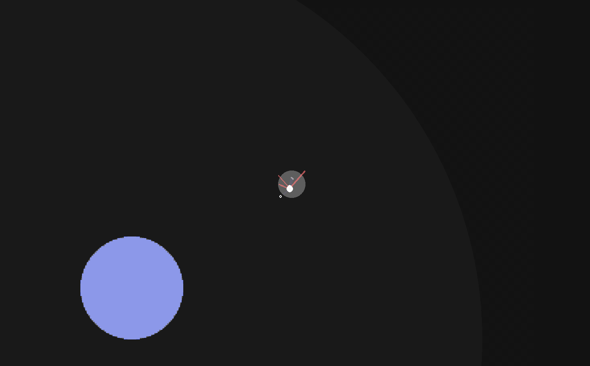
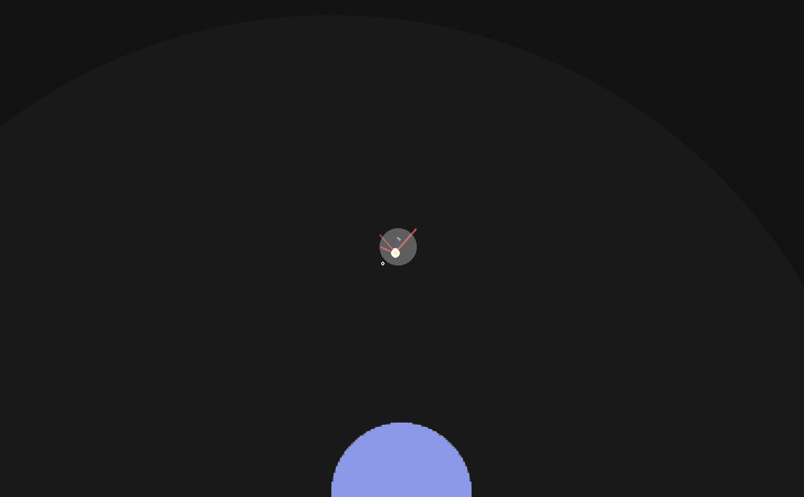

# Escape Velocity

A prototype gravity-based physics game written in C where you pilot a space probe around the solar system. 

Use the WASD keys to thrust in a direction, and hold the spacebar for a massive boost. Thrusting uses up your limited supply of fuel. Once it's gone, you're dead in the water.

In order to go the furthest you can, you'll have to use your fuel smartly, and rely on gravity to help slingshot you around space. 

## Cool Technical Features
- This game is written in C using the Oogabooga engine for rendering. Everything else is hand written by me.
- Custom physics and collision with AABB and Circle collisions, as well as realistic gravity simulation
- World serialisation/deserialisation
- Project files for images/audio using Aseprite and Reaper Audio
- C debugger/LSP setup using RemedyBG and CCLS

## Builds 
This project uses a C unity build with Clang to keep things simple. I prefer to leave that purple Windows IDE over at my day job.

### Quickstart
Currently, we only support Windows x64 systems.
1. Make sure Windows SDK is installed
1. Install clang, add to path
1. Clone repo to <project_dir>
1. Run `build.bat`
1. Run build/cgame.exe
1. profit
